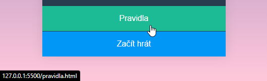
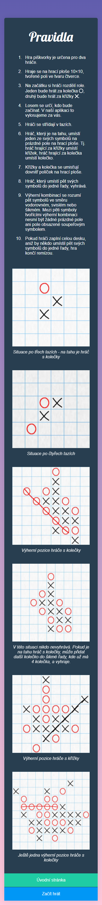
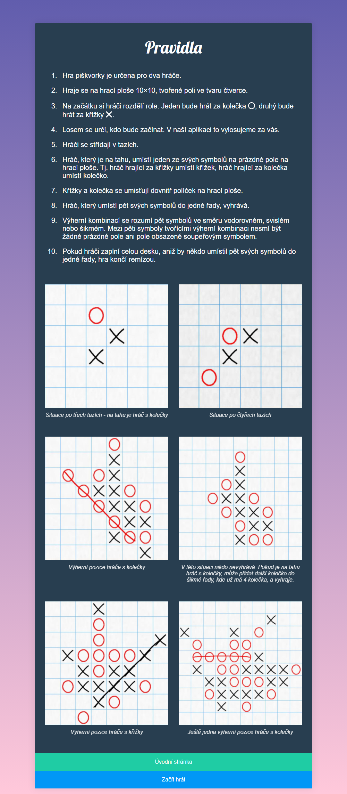
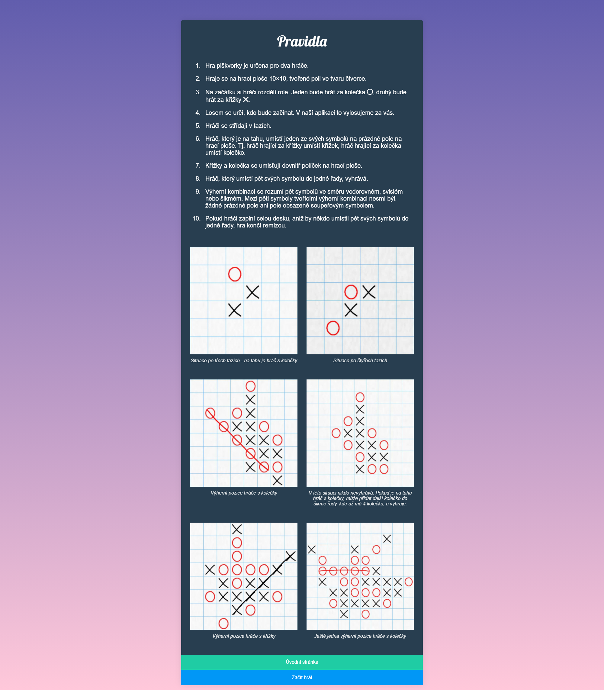
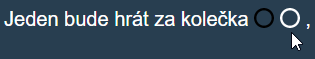
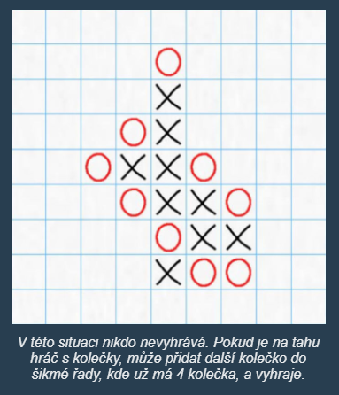

# Úkol: Piškvorky 2/5

Tento úkol navazuje na [Piškvorky 1](https://github.com/Czechitas-podklady-WEB/Ukol-Piskvorky-1). Tentokrát budeš kódovat stránku s pravidly.

## Zadání

1. Pokračuj v repozitáři `piskvorky` z prvního úkolu.

1. Vedle souboru `index.html` vytvoř `pravidla.html`.

1. Přidej do pravidel základní html strukturu a nalinkuj styly (`<link rel="stylesheet" href="styly.css" />`), které budou společné pro úvodní i tuto stránku.

1. Uprav odkaz v `index.html` směřující na pravidla, aby vedl na `pravidla.html` (`href="pravidla.html"`).

   

1. Vše si průběžně kontroluj v prohlížeči. Tlačítko `Pravidla` by zatím mělo otevírat prázdnou stránku s barevným přechodem na pozadí nebo čistě bílou.

1. Nezapomínej průběžně commitovat a nahrávat, pushovat změny na GitHub.

1. Podle potřeby si stáhni všechny obrázkové podklady.

   - Kroužek: [circle.svg](https://github.com/Czechitas-podklady-WEB/Ukol-Piskvorky-2/raw/main/podklady/circle.svg)
   - Křížek: [cross.svg](https://github.com/Czechitas-podklady-WEB/Ukol-Piskvorky-2/raw/main/podklady/cross.svg)
   - Ukázka ze hry č. 1: [instructions-01.jpg](https://github.com/Czechitas-podklady-WEB/Ukol-Piskvorky-2/raw/main/podklady/instructions-01.jpg)
   - Ukázka ze hry č. 2: [instructions-02.jpg](https://github.com/Czechitas-podklady-WEB/Ukol-Piskvorky-2/raw/main/podklady/instructions-02.jpg)
   - Ukázka ze hry č. 3: [instructions-03.jpg](https://github.com/Czechitas-podklady-WEB/Ukol-Piskvorky-2/raw/main/podklady/instructions-03.jpg)
   - Ukázka ze hry č. 4: [instructions-04.jpg](https://github.com/Czechitas-podklady-WEB/Ukol-Piskvorky-2/raw/main/podklady/instructions-04.jpg)
   - Ukázka ze hry č. 5: [instructions-05.jpg](https://github.com/Czechitas-podklady-WEB/Ukol-Piskvorky-2/raw/main/podklady/instructions-05.jpg)
   - Ukázka ze hry č. 6: [instructions-06.jpg](https://github.com/Czechitas-podklady-WEB/Ukol-Piskvorky-2/raw/main/podklady/instructions-06.jpg)

1. Podle následujících obrázků nastyluj stránku tak, aby se vše vešlo na úzké i široké obrazovky. Pozor na to, že GitHub může obrázky zmenšovat, aby se vešly do okna prohlížeče, takže některé rozměry můžou vypadat jinak, než bylo skutečně zamýšleno.

   

      
Úzká obrazovka

      
   

   

      
Široká obrazovka

      
   

   

      
Velmi široká obrazovka

      
Verze pro velmi široké obrazovky se příliš neliší od varianty pro široké obrazovky. Následující snímek má hlavně demonstrovat, že hlavní obsah má omezenou šířku.

      
   

1. Stránka z prvního úkolu by měla zůstat nedotčená.

1. Pro ušetření práce si můžeš následující texty zkopírovat.

   - `Hra piškvorky je určena pro dva hráče.`
   - `Hraje se na hrací ploše 10×10, tvořené poli ve tvaru čtverce.`
   - `Na začátku si hráči rozdělí role. Jeden bude hrát za kolečka, druhý bude hrát za křížky.`
   - `Losem se určí, kdo bude začínat. V naší aplikaci to vylosujeme za vás.`
   - `Hráči se střídají v tazích.`
   - `Hráč, který je na tahu, umístí jeden ze svých symbolů na prázdné pole na hrací ploše. Tj. hráč hrající za křížky umístí křížek, hráč hrající za kolečka umístí kolečko.`
   - `Křížky a kolečka se umisťují dovnitř políček na hrací ploše.`
   - `Hráč, který umístí pět svých symbolů do jedné řady, vyhrává.`
   - `Výherní kombinací se rozumí pět symbolů ve směru vodorovném, svislém nebo šikmém. Mezi pěti symboly tvořícími výherní kombinaci nesmí být žádné prázdné pole ani pole obsazené soupeřovým symbolem.`
   - `Pokud hráči zaplní celou desku, aniž by někdo umístil pět svých symbolů do jedné řady, hra končí remízou.`
   - `Situace po třech tazích - na tahu je hráč s kolečky`
   - `Situace po čtyřech tazích`
   - `Výherní pozice hráče s kolečky`
   - `V této situaci nikdo nevyhrává. Pokud je na tahu hráč s kolečky, může přidat další kolečko do šikmé řady, kde už má 4 kolečka, a vyhraje.`
   - `Výherní pozice hráče s křížky`
   - `Ještě jedna výherní pozice hráče s kolečky`

1. Nezapomeň ve třetím bodu pravidel použít obrázek kroužku a křížku. Jistě si všimneš, že jsou vyplněné černou barvou, ale v grafice se používá jejich bílá varianta. Vzhledem k tomu, že později na stránce se hrou budeš potřebovat černou i bílou zároveň, už teď se můžeš naučit novou vlastnost `filter`, která umí prvky přebarvit pomocí CSS. Více se dočteš zde: [developer.mozilla.org/en-US/docs/Web/CSS/filter#invert](https://developer.mozilla.org/en-US/docs/Web/CSS/filter#invert).

   

1. Velikost ikonek by měla vycházet z velikosti textu. Konkrétně `width: 1em; height: 1em`. Zvětší se tím automaticky podle velikosti písma, které má být různé pro úzké a pro široké obrazovky.

1. Na ukázky ze hry s viditelnými popisky použij HTML prvky `<figure>`, `` a `<figcaption>`. Více se dočteš opět třeba na [developer.mozilla.org/en-US/docs/Web/HTML/Element/figure](https://developer.mozilla.org/en-US/docs/Web/HTML/Element/figure).

   

1. Odkaz `Úvodní stránka` nasměruj na `index.html`. Stejně tak `Začít hrát`, protože stránku s hrou zatím nemáš vytvořenou.

1. Obě tlačítka ztmav po najetí myši úplně stejně jako na úvodní stránce.
