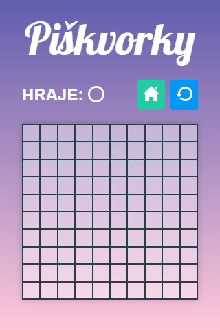

# Úkol: Piškvorky 3/5

Tento úkol navazuje na [Piškvorky 1](https://github.com/Czechitas-podklady-WEB/Ukol-Piskvorky-1) a [Piškvorky 2](https://github.com/Czechitas-podklady-WEB/Ukol-Piskvorky-2). Čeká tě kódování stránky s herní mřížkou.

## Zadání

1. Pokračuj v repozitáři `piskvorky` z prvního a druhého úkolu.

1. Přidej poslední, třetí html soubor `hra.html` a odkaž na něj z tlačítek `Začít hrát` z předchozích stránek.

1. Podle potřeby si stáhni všechny obrázkové podklady.

   - Domů: [home.svg](https://github.com/Czechitas-podklady-WEB/Ukol-Piskvorky-3/raw/main/podklady/home.svg)
   - Znovu: [restart.svg](https://github.com/Czechitas-podklady-WEB/Ukol-Piskvorky-3/raw/main/podklady/restart.svg)

1. Uprav html a css podle obrázků níže.

   

      
Úzká obrazovka

      
   

   

      
Širší obrazovka

      
   

1. V tomto úkolu nebudeš potřebovat `@media query`. Hlavnímu obsahu nastav maximální šířku pomocí `max-width: 80vmin`. Stránka se tak bude lépe přízpůsobovat širokoúhlým obrzovkám i telefonům na výšku.

1. Pro tlačítka v pravém horním rohu použij html prvek `<a>`. První tlačítko nasměru na úvodní stránku a druhé na `hra.html`, aby znovu načetlo právě zobrazenou stránku. Nezapomeň na stejné zatmavení po najetí myši jako u předchozích stránek.

   

1. Pro jednotlivá políčka, celkem jich je 100, použij html prvek `<button>`. Po najetí myši by se měl lehce rozsvítit.

   

### Poznámky:

- V příštím úkole budeš měnit ikonku právě hrajícího hráče pomocí javascriptu. Zatím použij staticky, jen s použitím html a css, kroužek.

  

- Efekty po najetí myši se většinou týkají i stavu `:focus`, aby se stránka dala ovládat například i z klávesnice.
